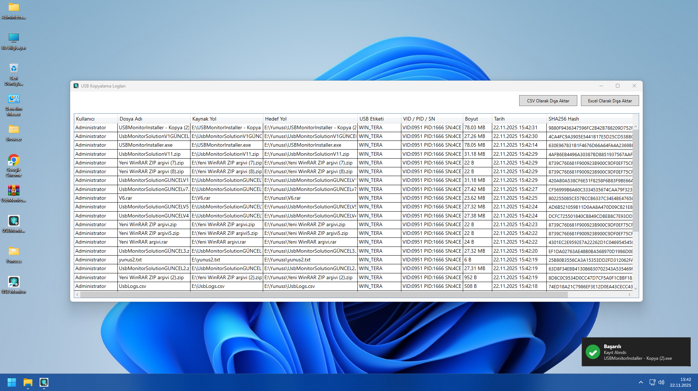
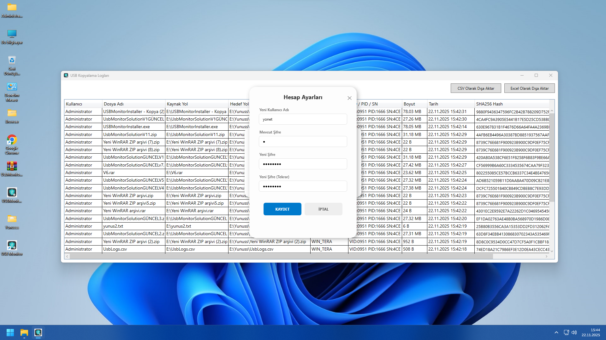
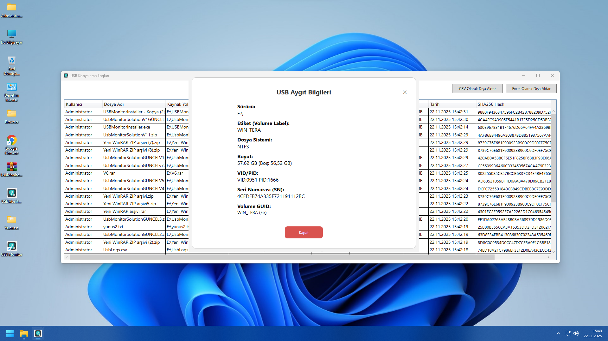
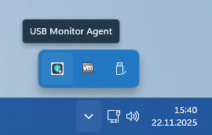
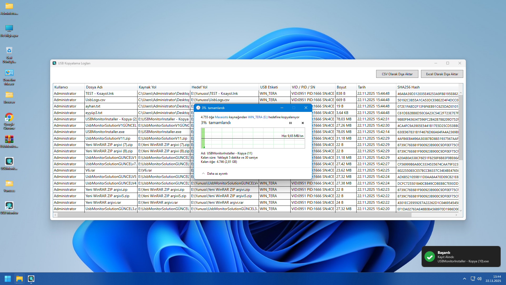

# 🛡️ UsbMonitorSuite
**Advanced USB Forensics & Activity Monitoring System**

  

> **UsbMonitorSuite**, kurumsal ve kişisel güvenlik için geliştirilmiş, USB cihazlarındaki ve sabit disklerdeki dosya hareketlerini (PC ↔ USB arası veri giriş-çıkışı) gerçek zamanlı takip eden, **Windows Service** ve **WPF Agent** mimarisiyle çalışan gelişmiş bir izleme çözümüdür.

---

## 📸 Ekran Görüntüleri (Screenshots)

Uygulamanın modern arayüzü ve temel özellikleri:

| **📊 Canlı Log Takibi (Dashboard)** | **⚙️ Servis Yönetim Paneli** |
|:---:|:---:|
|  <br> *Anlık dosya hareketleri, Hash bilgisi ve Kaynak tespiti* |  <br> *Windows servisini arayüzden durdur/başlat* |

| **🔐 Güvenli Yönetici Girişi** | **💾 USB Donanım Detayları** |
|:---:|:---:|
|  <br> *SHA256 korumalı yetkili giriş ekranı* |  <br> *VID, PID ve Serial Number (SN) analizi* |

| **🔔 Sistem Tepsisi (Tray Menu)** | **📂 Genel Görünüm** |
|:---:|:---:|
|  <br> *Hızlı erişim menüsü ve durum kontrolü* |  <br> *Kullanıcı dostu veri tablosu* |

---

## 🌟 Temel Özellikler & Yenilikler

### 🔍 Gelişmiş Kaynak Tespiti (Advanced Source Detection)
Standart izleyicilerin aksine, **Sürükle-Bırak (Drag & Drop)** işlemlerinde bile dosyanın nereden geldiğini (Masaüstü, C:, D: vb.) tespit eder.
* **Recursive Parent Check:** Klasör kopyalamalarında üst dizinleri tarayarak kaynağı bulur.
* **Clipboard & Explorer API:** Kopyala-Yapıştır ve Sürükle-Bırak işlemlerini hibrit yöntemle yakalar.
* **Smart Drive Filter:** Sabit diskten sabit diske (Örn: C -> C) olan gereksiz kopyalamaları filtreler, sadece USB giriş-çıkışlarını loglar.

### 🛡️ Güvenlik ve Kararlılık
* **Debounce Protection:** Aynı dosya için milisaniyeler içinde oluşan mükerrer logları engeller, ancak dosya üzerine yazma (Overwrite) işlemlerini kaçırmaz.
* **SHA256 Hashing:** Yönetici şifreleri ve dosya bütünlüğü SHA256 ile korunur.
* **Service & Agent Ayrımı:** Arayüz kapalı olsa bile **Windows Servisi** arka planda (SYSTEM yetkisiyle) kaydetmeye devam eder.
* **0-Byte Fix:** Dosya kopyalama tamamlanmadan boyutu "0" olarak kaydetme sorununu, dosya kilidi kalkana kadar bekleyip `Refresh()` yaparak çözer.

### 💎 Modern UI/UX
* **WPF Modern Design:** Çerçevesiz (No-Border), gölgeli ve yuvarlak köşeli pencereler.
* **Tray Notification:** İşlem yapıldığında sağ alt köşede şık "Toast" bildirimleri.
* **Servis Yöneticisi:** `sc stop/start` komutlarıyla uğraşmadan, şifreli arayüz üzerinden servisi yönetebilme.

---

## 🧩 Mimari Yapı

Proje iki ana bileşenden oluşur:

1.  **🛠️ UsbMonitorService (Backend)**
    * Windows Servisi olarak çalışır (`SYSTEM` yetkisi).
    * Veritabanı işlemlerini yönetir (`SQLite`).
    * Agent kapalıyken "Fallback" moduna geçer ve izlemeye devam eder.
    * `Named Pipe` üzerinden Agent ile haberleşir.

2.  **💻 UsbMonitorAgent (Frontend)**
    * Kullanıcı arayüzüdür (WPF).
    * Clipboard ve Windows Explorer API'lerine erişerek "Kaynak Yol" tespiti yapar.
    * Sistem tepsisinde (Tray) çalışır.
    * Yönetici girişi ile logları gösterir ve ayarları yönetir.

---

## 🗃️ Veritabanı Şeması (SQLite)

Veriler `C:\ProgramData\UsbMonitor\usb_logs.db` konumunda saklanır.

| Sütun | Tip | Açıklama |
| :--- | :--- | :--- |
| `Id` | INT | Otomatik artan kayıt ID |
| `Username` | TEXT | İşlemi yapan Windows kullanıcısı |
| `FileName` | TEXT | Dosya adı |
| `SourcePath` | TEXT | Dosyanın kopyalandığı kaynak yol (C:\Desktop\...) |
| `DestPath` | TEXT | USB üzerindeki hedef yol (F:\...) |
| `DriveLabel` | TEXT | USB Etiketi (Örn: KINGSTON) |
| `DeviceIdentity`| TEXT | Donanım Kimliği (VID / PID / Seri No - Cross Reference yöntemi ile) |
| `FileSize` | INT | Dosya boyutu (Byte) |
| `TimestampUtc` | TEXT | İşlem zamanı (UTC ISO 8601) |
| `FileHash` | TEXT | Dosyanın SHA256 Hash değeri |

---

## 🚀 Kurulum ve Çalıştırma

### 1. Derleme (Build)
Projeyi Visual Studio 2022 ile açın ve **Release** modunda derleyin (`Ctrl + Shift + B`).

### 2. Servis Kurulumu (Yönetici Modu)
PowerShell veya CMD'yi **Yönetici Olarak** çalıştırın ve servisi kaydedin:

```powershell
# Servis zaten varsa durdur ve sil
sc.exe stop UsbMonitorService
sc.exe delete UsbMonitorService

# Yeni servisi oluştur (Yolunu kendi bilgisayarınıza göre düzenleyin!)
# Örnek: bin\Release\net8.0-windows\win-x64\UsbMonitorService.exe
sc.exe create UsbMonitorService binPath= "C:\ProjeYolu\UsbMonitorService.exe" start= auto

3. Agent'ı Başlatma
UsbMonitorAgent.exe uygulamasını çalıştırın. Sistem tepsisine (sağ alt) yerleşecektir.

Varsayılan Giriş: yonet / Qq123456

Sağ tık menüsünden "Admin Ayarları" ile şifrenizi değiştirebilirsiniz.

<div align="center">

📥 İndir (Download)
Projeyi derlemekle uğraşmak istemiyorsanız, hazır kurulum (Setup) dosyasını doğrudan aşağıdan indirebilirsiniz:

<a href="https://drive.google.com/file/d/10VLbPvbSWoSvfqFagYE_XbMst19eJ-gl/view?usp=sharing">  </a>


⚠️ Önemli Not: İndirdiğiniz dosyayı klasöre çıkartıp USBMonitorInstaller.exe ile kurulumu başlatabilirsiniz.

</div>

🛠️ Kullanılan Teknolojiler & Kütüphaneler
.NET 6.0 / 8.0 (Windows)

WPF (Windows Presentation Foundation)

SQLite & Microsoft.Data.Sqlite

System.Management (WMI) - Donanım ID tespiti için.

System.ServiceProcess - Servis kontrolü için.

Interop.Shell32 & Interop.SHDocVw - Windows Explorer entegrasyonu için.

👤 Geliştirici
Yunus İNAN 🚀 .NET Developer | Security & Monitoring Enthusiast 📧 İletişim & Linkler

📜 Lisans
Bu proje MIT License altında lisanslanmıştır. Güvenlik ve denetim amaçlı eğitim/kurumsal kullanım için geliştirilmiştir.

# Servisi başlat
sc.exe start UsbMonitorService
